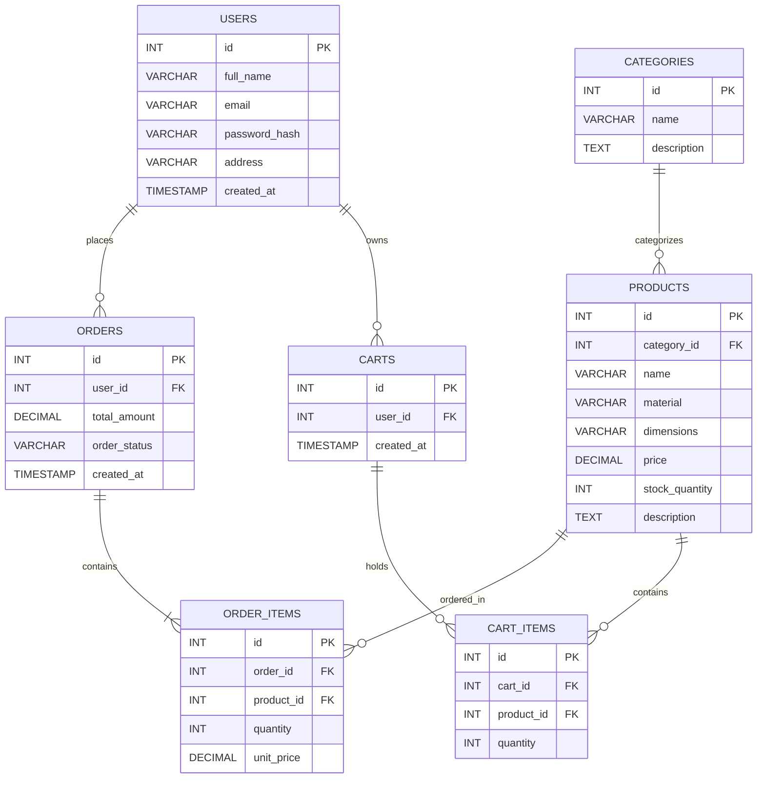

# 1. Section 1: Target Audience & Market Focus

 **Primary Persona:** Homeowners, apartment renters, and interior design enthusiasts (aged 22–50) seeking stylish, modern, and affordable home furniture and decor.

 **Core Pain Point:** Traditional brick-and-mortar furniture shopping requires physical travel and lacks clear dimensional visualization, while standard online furniture stores often fail to provide detailed material specifications, spatial room planning tools, or reliable delivery tracking for heavy items.

 **Domain Scope:** Home Goods & Furniture Retail (Living Room, Bedroom, Home Office, and Outdoor Furnishings).

 # 2. Section 2: Minimum Viable Product (MVP) Feature Scope

| Category           | Feature Name                       | Description                                                                                                                                  | Priority   |
| :----------------- | :--------------------------------- | :------------------------------------------------------------------------------------------------------------------------------------------- | :--------- |
| **Authentication** | User Registration & Authentication | Secure user signup, login, and session persistence using bcrypt password hashing and JWT-based authentication.                               | High (MVP) |
| **Catalog**        | Product List & Filter              | Showcase furniture collections with taxonomy-based filtering (by room, material, dimensions, and price range) and keyword search.            | High (MVP) |
| **Cart**           | Persistent Cart Management         | Shopping cart supporting state-persistent item addition, quantity updates, dimension/color variant selection, and item deletion.             | High (MVP) |
| **Checkout**       | Order & Shipping Processing        | Order instantiation with shipping address collection, delivery fee calculation for bulky items, and mock/Stripe payment gateway integration. | High (MVP) |
| **Admin**          | Furniture Inventory Control        | Administrative dashboard for performing CRUD operations on furniture items, managing stock levels, and assigning categories/materials.       | Medium     |

## Section 3: Tech Stack Selection & Justification

* **Frontend Framework:** **HTML5, CSS3, & JavaScript (or React)**
  * **Justification:** Using standard web technologies (HTML/CSS/JavaScript) keeps the application lightweight, fast, and easy to structure. It allows for simple, reactive UI components like dynamic cart updates, furniture filtering by room/material, and clean product image displays without complex overhead.

* **Backend Infrastructure:** **Node.js with Express**
  * **Justification:** Node.js uses JavaScript on the server side, allowing the team to use a single programming language across both frontend and backend. Express simplifies creating REST APIs for managing furniture catalogs, user authentication, and order submissions.

* **Database Management System:** **MySQL**
  * **Justification:** MySQL is a reliable, structured relational database ideal for e-commerce data. It ensures strict data integrity for connected tables like users, products, categories, carts, and order items using clear primary and foreign keys.

* **Caching & Asynchronous Processing (Optional):** **Redis**
  * **Justification:** Redis can be used as an optional in-memory cache to temporarily store persistent user cart items and speed up repeated product searches.

  ## Section 4: Entity-Relationship Diagram (ERD)

The relational database schema models the furniture e-commerce domain, mapping user accounts, product categories, furniture inventory, shopping cart persistence, and order processing workflows.

