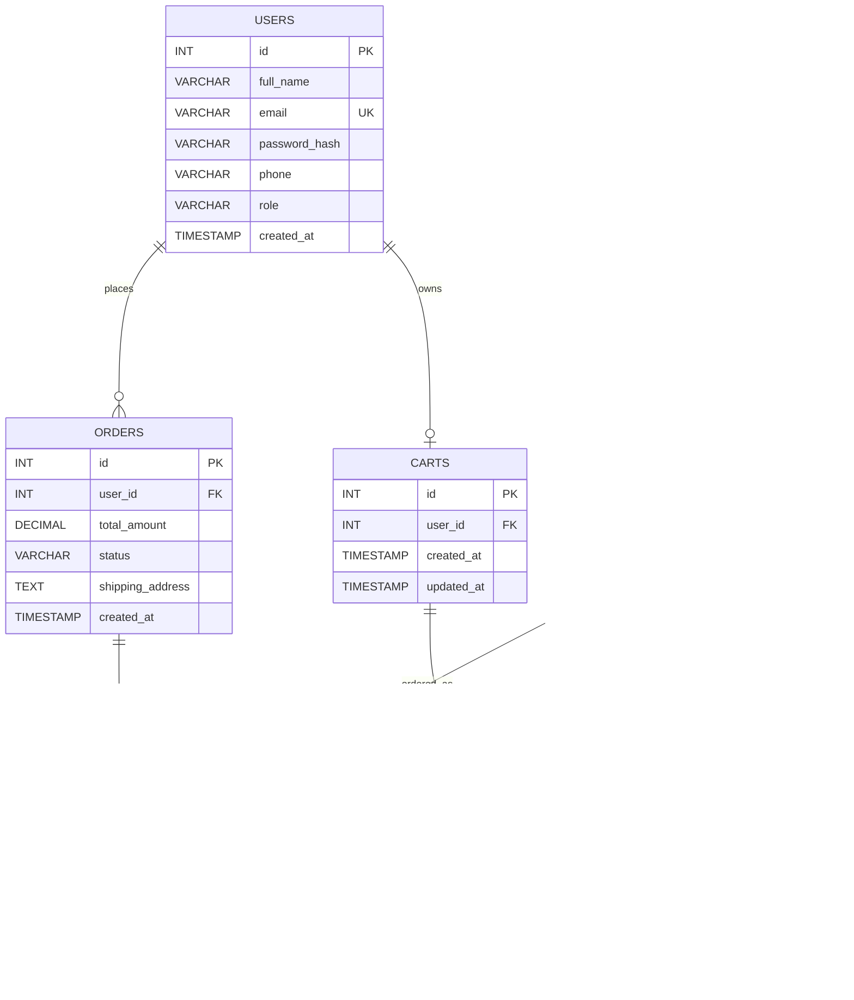

# Sprint 1: Project Foundation and MVP Definition
### Project: Furniture E-Commerce Platform

## 1. Target Audience & Market Focus

**Primary Persona:** Homeowners, apartment renters, and interior-design enthusiasts (aged 22–50) looking for stylish, modern, and affordable furniture and home decor.

**Core Pain Point:** Traditional furniture shopping often requires customers to visit multiple physical stores to compare products, prices, dimensions, materials, and availability. Online furniture stores can also make it difficult to understand product specifications, available variations, and order status in one place.

**Domain Scope:** Home Goods & Furniture Retail, including:
- Living Room Furniture
- Bedroom Furniture
- Home Office Furniture
- Outdoor Furniture and Decor

---

## 2. Product Vision

The goal of the Furniture E-Commerce Platform is to provide customers with a simple web-based shopping experience where they can browse furniture, search and filter products, select available product options, add items to a cart, and place orders.

The platform will also provide an administrative interface for managing furniture products, categories, prices, and stock information.

---

## 3. Minimum Viable Product (MVP) Feature Scope

| Category | Feature | Description | Priority |
| :--- | :--- | :--- | :--- |
| **Authentication** | User Registration & Login | Customers can create an account and securely log in. Authentication will use password hashing and JWT-based sessions. | High (MVP) |
| **Catalog** | Product Listing | Customers can view available furniture products with names, images, descriptions, prices, materials, dimensions, and availability information. | High (MVP) |
| **Search & Filter** | Product Search and Filtering | Customers can search for furniture and filter products by category, material, dimensions, and price range. | High (MVP) |
| **Product Details** | Product Detail View | Customers can view complete information about a selected furniture product and its available options. | High (MVP) |
| **Cart** | Shopping Cart | Customers can add products to a cart, update quantities, and remove items before checkout. | High (MVP) |
| **Checkout** | Order & Shipping | Customers can provide a shipping address and submit an order. Delivery charges can be calculated according to the project's shipping rules. | High (MVP) |
| **Admin** | Inventory Management | Administrators can create, view, update, and manage furniture products, categories, prices, and stock. | Medium |
| **Order Management** | Order Status | Administrators can view customer orders and update their status. | Medium |

### MVP Boundary

Sprint 1 defines the required customer and administrator functionality. Detailed database implementation, API development, validation rules, and automated tests will be developed in later sprints.

---

## 4. Initial User Stories

| ID | User Story | Priority |
| :--- | :--- | :--- |
| US01 | As a customer, I want to register an account so that I can use the shopping platform. | High |
| US02 | As a customer, I want to log in securely so that I can access my account. | High |
| US03 | As a customer, I want to browse furniture products so that I can find items I may want to purchase. | High |
| US04 | As a customer, I want to search and filter products so that I can find suitable furniture more quickly. | High |
| US05 | As a customer, I want to view product details so that I can understand the item's material, dimensions, price, and availability. | High |
| US06 | As a customer, I want to add products to my cart so that I can purchase multiple items together. | High |
| US07 | As a customer, I want to update or remove cart items so that I can control my order before checkout. | High |
| US08 | As a customer, I want to enter my shipping information and place an order so that the furniture can be delivered to me. | High |
| US09 | As an administrator, I want to manage products and categories so that the online catalog remains up to date. | Medium |
| US10 | As an administrator, I want to manage stock and order status so that inventory and customer orders can be monitored. | Medium |

---

## 5. Technology Stack Selection & Justification

### Frontend: HTML5, CSS3, and JavaScript

**Justification:** Standard web technologies provide the foundation for building a responsive and accessible e-commerce interface. JavaScript will be used for interactive features such as product filtering, cart updates, form validation, and dynamic user-interface behavior.

> **Note:** React is not listed as an alternative in Sprint 1. The project uses one defined frontend stack so that later sprint documentation remains consistent.

### Backend: Node.js with Express.js

**Justification:** Node.js allows JavaScript to be used on the server side, while Express.js provides a lightweight framework for building REST APIs. The backend will handle authentication, product management, cart operations, orders, and communication with the database.

### Database: MySQL

**Justification:** MySQL is a relational database system suitable for structured e-commerce data. It supports relationships between users, products, categories, carts, orders, and order items through primary and foreign keys.

### Authentication: JWT + bcrypt

**Justification:** JWT can be used for authenticated API requests, while bcrypt can be used to securely hash user passwords before storing them in the database.

### Optional Supporting Technology: Redis

Redis may be considered in a later sprint if caching or other in-memory processing is required. It is **not part of the mandatory Sprint 1 implementation**.

---

## 6. Initial System Architecture

The initial architecture consists of three main layers:

```text
+---------------------------+
|        Frontend           |
| HTML5 + CSS3 + JavaScript |
+-------------+-------------+
              |
              | HTTP / REST API
              v
+---------------------------+
|         Backend           |
|    Node.js + Express.js   |
+-------------+-------------+
              |
              | SQL
              v
+---------------------------+
|          MySQL            |
|   Relational Database     |
+---------------------------+
```

The frontend communicates with the backend through REST API endpoints. The backend handles business logic and communicates with MySQL for persistent data storage.

---

## 7. Initial Data Model / ERD

Sprint 1 establishes the **initial core entities** required by the MVP. Detailed catalog extensions such as product variants, SKUs, and media assets are intentionally left for later sprints so the database model can be refined after requirements analysis.


```mermaid
erDiagram
    USERS ||--o{ ORDERS : places
    USERS ||--o| CARTS : owns
    CATEGORIES ||--o{ PRODUCTS : contains
    CARTS ||--o{ CART_ITEMS : contains
    PRODUCTS ||--o{ CART_ITEMS : added_as
    ORDERS ||--|{ ORDER_ITEMS : contains
    PRODUCTS ||--o{ ORDER_ITEMS : ordered_as

    USERS {
        INT id PK
        VARCHAR full_name
        VARCHAR email UK
        VARCHAR password_hash
        VARCHAR phone
        VARCHAR role
        TIMESTAMP created_at
    }

    CATEGORIES {
        INT id PK
        VARCHAR name
        TEXT description
        BOOLEAN is_active
        TIMESTAMP created_at
    }

    PRODUCTS {
        INT id PK
        INT category_id FK
        VARCHAR name
        VARCHAR slug UK
        VARCHAR material
        VARCHAR dimensions
        DECIMAL price
        INT stock_quantity
        TEXT description
        VARCHAR status
        TIMESTAMP created_at
        TIMESTAMP updated_at
    }

    CARTS {
        INT id PK
        INT user_id FK
        TIMESTAMP created_at
        TIMESTAMP updated_at
    }

    CART_ITEMS {
        INT id PK
        INT cart_id FK
        INT product_id FK
        INT quantity
    }

    ORDERS {
        INT id PK
        INT user_id FK
        DECIMAL total_amount
        VARCHAR status
        TEXT shipping_address
        TIMESTAMP created_at
    }

    ORDER_ITEMS {
        INT id PK
        INT order_id FK
        INT product_id FK
        INT quantity
        DECIMAL unit_price
    }
```

### Initial Relationship Explanation

- One **user** can place many orders.
- One **user** can have one active cart.
- One **category** can contain many products.
- One **cart** can contain many cart items.
- Each cart item refers to one product.
- One **order** contains one or more order items.
- Each order item refers to a product and stores the purchase-time unit price.

The ERD is an initial Sprint 1 model. Later sprints may extend it without changing the overall project purpose.

---

## 8. Non-Functional Requirements

| Requirement | Description |
| :--- | :--- |
| **Usability** | The interface should be simple and understandable for customers and administrators. |
| **Responsiveness** | The website should work on desktop, tablet, and mobile screen sizes. |
| **Security** | Passwords must not be stored as plain text. Authenticated API requests should use secure authorization mechanisms. |
| **Performance** | Product listing and filtering should provide results without unnecessary page reloads. |
| **Data Integrity** | Relational constraints should be used to maintain valid relationships between database records. |
| **Maintainability** | Frontend, backend, and database responsibilities should remain separated. |
| **Scalability** | The data model should allow future additions such as product variants, media assets, reviews, and improved search. |

---

## 9. Sprint 1 Deliverables

The following items are the planned deliverables for Sprint 1:

1. Project requirements and target-user definition.
2. MVP feature list and initial user stories.
3. Selected technology stack.
4. Initial system architecture.
5. Initial database/ERD design.
6. Basic UI/UX planning for customer and administrator interfaces.
7. Project repository and documentation structure.
8. Identification of requirements to be implemented in later sprints.

---

## 10. Sprint 1 Definition of Done

A Sprint 1 item is considered complete when:

- The requirement is clearly documented.
- The related user story has been defined where applicable.
- The requirement has an identified priority.
- The initial design or model has been documented where required.
- The technology decision has been recorded and justified.
- No unsupported implementation or test result is claimed as completed.
- The work is committed to the project repository.

---

## 11. Sprint 1 Limitations and Future Work

The following items are outside the detailed implementation scope of Sprint 1 and can be addressed in later sprints:

- Detailed product variant and SKU modeling.
- Product image/media asset management.
- Detailed category hierarchy.
- Complete REST API implementation.
- Database migrations and seed data.
- Automated backend testing.
- Public product search API.
- Payment gateway integration.
- Shipping and delivery tracking.
- Product review functionality.
- Advanced administration features.

These items are recorded as future work rather than being presented as completed Sprint 1 functionality.
