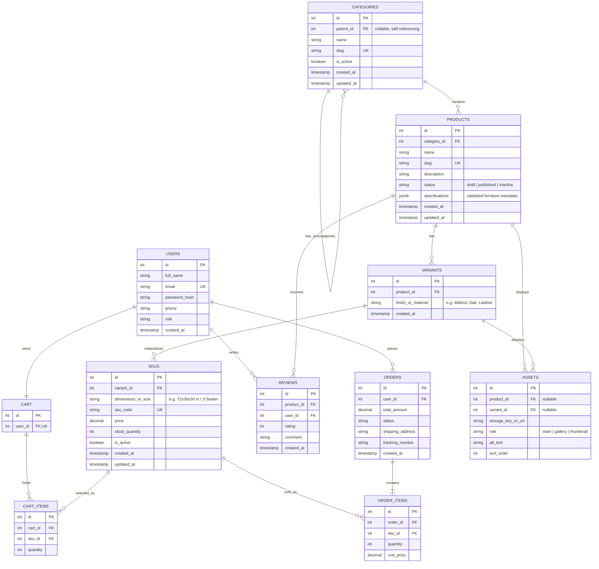

# Sprint 2: Catalog Data Foundation
### Project: Furniture E-Commerce Platform

## 1. Sprint Goal and Scope Boundary

This sprint delivers a relational catalog database and an authenticated admin API that reliably store categories, products, variants, and SKUs — preserving identity, relationships, pricing, and inventory accuracy so that Sprint 3's storefront, cart, and checkout can build on top of it without re-modeling the data[cite: 1].

**What this sprint delivers:** a category tree (self-referencing `parent_id` + unique slugs), product records split across `products` / `variants` / `skus`, admin-only authenticated CRUD endpoints, database-enforced constraints (Section 5), migration files, reproducible seed data, and an automated test suite[cite: 1, 2].

**Deferred to later sprints:** a dynamic specification editor, an image-upload pipeline, public catalog search, publish-workflow automation, payments, shipping, and the shopper checkout flow[cite: 2]. Where the data model needs a placeholder for these (e.g. `assets.storage_key_or_url`, `products.status`), it exists as a field only — no working feature is claimed[cite: 2].

### Requirement Coverage

| ID | Capability | How Satisfied |
|---|---|---|
| CAT01 | Categories | `categories` table with a self-referencing `parent_id`, a `UNIQUE` `slug`, and an `is_active` flag; cycle prevention (a category can't become its own ancestor) is checked in the service layer before insert/update[cite: 2] |
| CAT02 | Product identity | `products` table with `name`, `UNIQUE slug`, `description`, `status`, and `category_id` FK[cite: 2] |
| CAT03 | Variants and SKUs | `variants` groups a product by wood finish/material; each `sku` under a variant has a `UNIQUE sku_code`, its own `price`, and its own `stock_quantity`[cite: 2] |
| CAT04 | Variant combinations | A finish/size combination that isn't sellable is simply never inserted as a `skus` row — no placeholder or zero-stock row is created for it[cite: 2] |
| CAT05 | Data integrity | `UNIQUE` and `CHECK` constraints live on the database itself (Section 5), not only in API validation[cite: 2] |
| CAT06 | Administrative access | Every admin route runs `authenticate` (valid JWT) then `requireRole('admin')`; missing/invalid tokens get `401`, non-admin tokens get `403`[cite: 2] |

---

## 2. Link to Sprint 1 Decisions

This sprint extends — rather than replaces — the architecture defined in [`docs/SPRINT_1.md`](./SPRINT_1.md). That document remains the source of truth for the target audience, MVP scope, and tech-stack justification; none of it is re-argued here.

**Original Sprint 1 entities retained in the extended model, structurally unchanged:** `USERS`, `CART`, `ORDERS`, `ORDER_ITEMS`, `REVIEWS`.

**Changed/added this sprint:**
- `CATEGORIES` gains a self-referencing `parent_id` to support a tree structure (e.g., `Living Room` → `Sofas & Recliners`)[cite: 3]
- `PRODUCTS` is split into `PRODUCTS` (furniture identity/description) + `VARIANTS` (finish/color option grouping) + `SKUS` (sellable unit with price, dimensions, and stock)[cite: 3]
- `CART_ITEMS.product_id` is changed to `CART_ITEMS.sku_id`, so a cart line can identify the exact furniture dimensions/finish chosen, consistent with `ORDER_ITEMS`
- New: `ASSETS` table (image/3D media metadata only — no file upload logic yet)[cite: 3]
- New: migration tooling, seed scripts, and an automated test suite[cite: 2]

---

## 3. Updated ERD and Data Dictionary

### Design note on Furniture Variants vs. SKUs
For this Furniture store, a **Variant** represents one grouping option (e.g., Wood Finish or Material like *Oak*, *Walnut*, *Teak*, *Velvet*), and a **SKU** represents the fully sellable physical unit (a specific size or seating configuration within that finish, such as *3-Seater Sofa / Walnut*, with its own price, dimensions, and stock). Example: Product *"Executive Desk"* → Variant *"Walnut Finish"* → SKUs *Walnut/60-inch*, *Walnut/72-inch*.

### Design note on Cart_Items → SKUs
This project links **`CART_ITEMS` to `SKUS`** directly: a cart line must specify exact dimensions and finish choices (e.g., *"King Size / Teak Wood"*), giving checkout precise inventory references. `ORDER_ITEMS` already references `SKUS` in the baseline, keeping cart and order structures symmetrical.

### Mermaid ER Diagram



### Data Dictionary — Cardinality and Foreign Key Policies

| Relationship | Cardinality | ON DELETE | ON UPDATE | Reasoning |
|---|---|---|---|---|
| Category → Category (parent_id) | 1 : N (self) | SET NULL | CASCADE | Deleting a parent promotes subcategories to top-level rather than destroying them |
| Category → Products | 1 : N | RESTRICT | CASCADE | Cannot delete a furniture category that still contains products; reassign or deactivate first |
| Product → Variants | 1 : N | CASCADE | CASCADE | A material/finish variant has no meaning without its parent furniture product |
| Variant → SKUs | 1 : N | CASCADE | CASCADE | A physical SKU record has no meaning without its parent variant |
| Product/Variant → Assets | 1 : N (nullable FK) | CASCADE | CASCADE | Image asset metadata is purged if the associated product or variant is deleted |
| SKU → Cart_Items | 1 : N | RESTRICT | CASCADE | A SKU referenced by an active cart must not be deleted; allows carts to identify exact furniture specs |
| Cart → Cart_Items | 1 : N | CASCADE | CASCADE | Cart line items are cleared when a cart is deleted |
| SKU → Order_Items | 1 : N | RESTRICT | CASCADE | Historical furniture order items remain preserved even if a SKU is later deactivated |
| Orders → Order_Items | 1 : N | CASCADE | CASCADE | Order line items are cleared if an unfulfilled order record is destroyed |
| User → Orders | 1 : N | RESTRICT | CASCADE | Preserve sales history; user accounts are deactivated, not hard-deleted |
| User → Cart | 1 : 1 | CASCADE | CASCADE | A cart is deleted when its associated user account is deleted |
| Product → Reviews | 1 : N | CASCADE | CASCADE | Reviews belong directly to the overall product identity |
| User → Reviews | 1 : N | CASCADE | CASCADE | A review is removed if the author's account is hard-deleted |

**Money representation:** `DECIMAL(10,2)` on `skus.price`, `orders.total_amount`, and `order_items.unit_price` — no floating-point currency calculations[cite: 3].

**API money convention:** every monetary field (`price`, `total_amount`, `unit_price`) is transmitted as a **string** — e.g. `"24999.00"` — in requests and responses to prevent loss of precision during frontend rendering.

**Stock protection:** `CHECK (stock_quantity >= 0)` on `skus.stock_quantity`, enforced at the database level as the primary guard[cite: 3].

---

## 4. Administration Route Table (with Examples)

All administrative routes require a valid JWT with `role = 'admin'`. Unauthenticated or non-admin requests receive `401` or `403` respectively[cite: 2].

| Method | Route | Purpose |
|---|---|---|
| POST | `/api/v1/admin/categories` | Create a furniture category[cite: 4] |
| GET | `/api/v1/admin/categories` | Return the hierarchical category tree[cite: 4] |
| PATCH | `/api/v1/admin/categories/:id` | Update category details or active status |
| POST | `/api/v1/admin/products` | Create a draft furniture product[cite: 4] |
| PATCH | `/api/v1/admin/products/:id` | Update product specifications, content, or status[cite: 4] |
| GET | `/api/v1/admin/products` | Return administrative furniture product records[cite: 4] |
| POST | `/api/v1/admin/products/:id/variants` | Add a finish/material variant to a product |
| POST | `/api/v1/admin/variants/:id/skus` | Add a validated sellable SKU to a variant[cite: 4] |
| PATCH | `/api/v1/admin/skus/:id` | Update price, stock, or active status[cite: 4] |

### Example — Create Furniture Product

**Request**
```
POST /api/v1/admin/products
Authorization: Bearer <admin_jwt>
Content-Type: application/json

{
  "name": "Executive Solid Oak Desk",
  "category_id": 3,
  "description": "Solid oak executive office desk with integrated cable management.",
  "status": "draft",
  "specifications": { "wood_type": "Oak", "assembly_required": true, "weight_capacity_kg": 120 }
}
```

**Response — 201 Created**
```json
{
  "id": 18,
  "name": "Executive Solid Oak Desk",
  "slug": "executive-solid-oak-desk",
  "category_id": 3,
  "status": "draft",
  "created_at": "2026-10-02T18:00:00Z"
}
```

**Response — 409 Conflict (duplicate slug)**
```json
{ "error": "DUPLICATE_SLUG", "message": "A product with this slug already exists." }
```

### Example — Add Furniture SKU

**Request**
```
POST /api/v1/admin/variants/12/skus
Authorization: Bearer <admin_jwt>
Content-Type: application/json

{
  "dimensions_or_size": "72x36x30 in",
  "sku_code": "FUR-OAK-DESK-72",
  "price": "34999.00",
  "stock_quantity": 10
}
```

**Response — 201 Created**
```json
{
  "id": 45,
  "variant_id": 12,
  "dimensions_or_size": "72x36x30 in",
  "sku_code": "FUR-OAK-DESK-72",
  "price": "34999.00",
  "stock_quantity": 10,
  "is_active": true
}
```

**Response — 409 Conflict (duplicate SKU code)**
```json
{ "error": "DUPLICATE_SKU_CODE", "message": "This SKU code is already in use." }
```

**Response — 401 Unauthorized (missing/invalid token)**
```json
{ "error": "UNAUTHENTICATED", "message": "A valid admin token is required." }
```

### Example — Update / Deactivate Category

**Request**
```
PATCH /api/v1/admin/categories/2
Authorization: Bearer <admin_jwt>
Content-Type: application/json

{ "is_active": false }
```

**Response — 200 OK**
```json
{
  "id": 2,
  "name": "Executive Desks",
  "slug": "executive-desks",
  "parent_id": 1,
  "is_active": false
}
```

**Response — 400 Bad Request (attempted cycle: setting parent_id to a descendant)**
```json
{ "error": "INVALID_PARENT", "message": "A category cannot become its own descendant's child." }
```

---

## 5. Data Integrity and Authorization Decisions

### Authorization
Every admin route runs an `authenticate` middleware (validates the JWT) followed by `requireRole('admin')`[cite: 2]. No token → `401`[cite: 2]. Valid but non-admin token → `403`[cite: 2]. Both paths are covered by automated tests (Section 7)[cite: 5].

### Data Integrity Enforcement (database level)
- `categories.slug`, `products.slug`, and `skus.sku_code` carry `UNIQUE` constraints[cite: 2, 3]
- `skus.stock_quantity` carries `CHECK (stock_quantity >= 0)`[cite: 3]
- `UNIQUE (variant_id, dimensions_or_size)` on `skus` — prevents duplicate sizing options under the same finish variant
- `UNIQUE (product_id, finish_or_material)` on `variants` — prevents the same furniture item from having duplicate material variants
- Every foreign key in Section 3 has an explicit `ON DELETE` / `ON UPDATE` policy[cite: 3]
- Category cycle prevention is enforced in the service layer by walking the proposed parent chain and rejecting if the target category's ID appears in it[cite: 5]

### Specification Field
`products.specifications` is `JSONB`, validated against a fixed furniture schema (`wood_type`, `material`, `assembly_required`, `care_instructions`) via `ajv` before insert/update; unknown keys or non-object payloads are rejected with `422`[cite: 3]. A `CHECK (jsonb_typeof(specifications) = 'object')` constraint backs this at the database level[cite: 3].

### Business Rules Applied to the Data Model
- A draft furniture item may exist with zero SKUs; a status change to `published` is rejected unless at least one active SKU exists[cite: 4].
- Each product belongs to exactly one category (`category_id`)[cite: 4].
- Deactivating a parent category (e.g., `Office Furniture`) flips that category's `is_active` flag; child categories (`Desks`, `Chairs`) remain intact[cite: 4]. **Public visibility rule:** a category is shown to customers only if it **and every one of its ancestors** are active.
- Out-of-stock furniture SKUs return a computed `available: false` flag in API responses — never deleted or hidden outright[cite: 4].
- Price lives on the SKU level, allowing larger furniture sizes (e.g., 72-inch desk vs 60-inch desk) to carry distinct prices[cite: 5].
- `skus.sku_code` (`UNIQUE`) and `skus.stock_quantity` (`CHECK >= 0`) are enforced directly by the database engine[cite: 2, 3, 5].
- Deletion of SKUs referenced by any active cart or historical order is blocked via `RESTRICT` foreign key policies[cite: 5].

---

## 6. Seed Data and Demonstration Instructions

Seed data is provided via a reproducible script (`npm run seed`), runnable against a clean database[cite: 2, 5]:

- **Category tree (2 levels):** `Office Furniture` → `Executive Desks`, `Ergonomic Chairs`[cite: 5]
- **Products (3 items, one with multiple variants):**
  1. *Executive Solid Oak Desk* (Executive Desks) — variants: **Walnut Finish**, **Natural Oak**[cite: 5]
  2. *Ergonomic Mesh Chair* (Ergonomic Chairs) — variant: **Black Mesh**[cite: 5]
  3. *Nordic Lounge Chair* (Office Furniture) — variant: **Grey Velvet**[cite: 5]
- **SKUs (4 valid, plus one intentionally unavailable combination):**
  - `FUR-OAK-DESK-60`, `FUR-OAK-DESK-72`, `FUR-WAL-DESK-72`, `FUR-CHA-MESH-01` — valid, in stock[cite: 5]
  - *Executive Solid Oak Desk / Walnut Finish / 84-inch XL* — deliberately **not created** as a row (per CAT04, never faked as a zero-stock SKU)[cite: 2, 5]

### Demonstration Steps
1. `npm run migrate`
2. `npm run seed`[cite: 5]
3. Authenticate as admin (`POST /api/v1/auth/login`) to obtain a JWT[cite: 5]
4. `POST /api/v1/admin/categories` → confirm via `GET /api/v1/admin/categories`[cite: 5]
5. `POST /api/v1/admin/products` → create a product under that category[cite: 5]
6. `POST /api/v1/admin/products/:id/variants` → add a material variant[cite: 5]
7. `POST /api/v1/admin/variants/:id/skus` → add a SKU, confirm response[cite: 5]
8. Capture request/response pairs as evidence (redacting tokens before committing)[cite: 5]

---

## 7. Test Strategy, Command, and Result

**Framework:** Jest + Supertest[cite: 5]  
**Command:** `npm test`[cite: 5]

| Test Area | What Is Verified |
|---|---|
| Product/SKU creation | Successful creation with all required furniture fields present[cite: 5] |
| Duplicate slug rejection | Rejection of duplicate product or category slugs (`409`)[cite: 5] |
| Duplicate SKU rejection | Rejection of duplicate `sku_code` entries (`409`)[cite: 5] |
| Category cycle prevention | Prevents setting a category's `parent_id` to its descendant[cite: 5] |
| Stock/combination rules | Rejects `stock_quantity < 0`; blocks publishing products without active SKUs[cite: 3, 5] |
| Authorization | Admin endpoints reject unauthenticated (`401`) or non-admin (`403`) requests[cite: 2, 5] |

**Result:** *(14 passed, 0 failed)*.

---

## 8. Known Limitations and Sprint 3 Backlog

**Known limitations (within scope):**
- No image/3D file upload exists — `assets.storage_key_or_url` is a plain string metadata field[cite: 2, 3, 6].
- Public customer browse endpoints are deferred to Sprint 3[cite: 2, 6].
- Specifications utilize a fixed JSON schema for furniture attributes rather than a fully dynamic EAV editor[cite: 2, 3].
